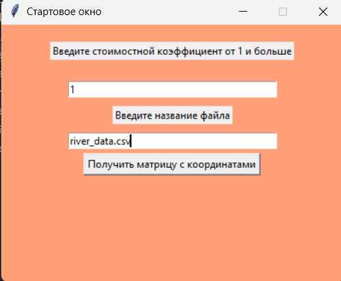
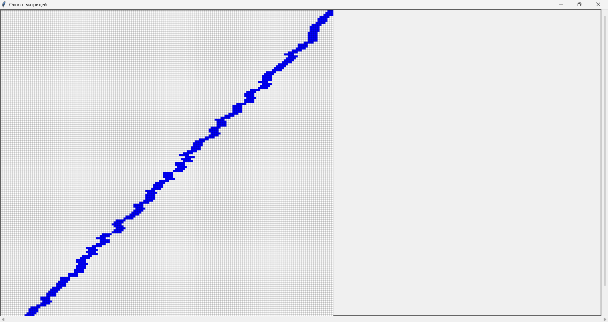
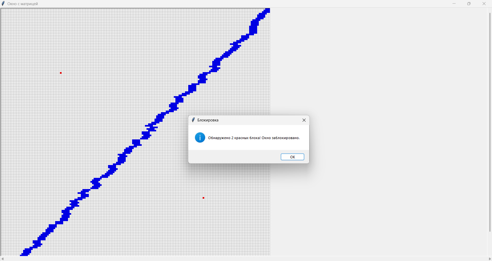
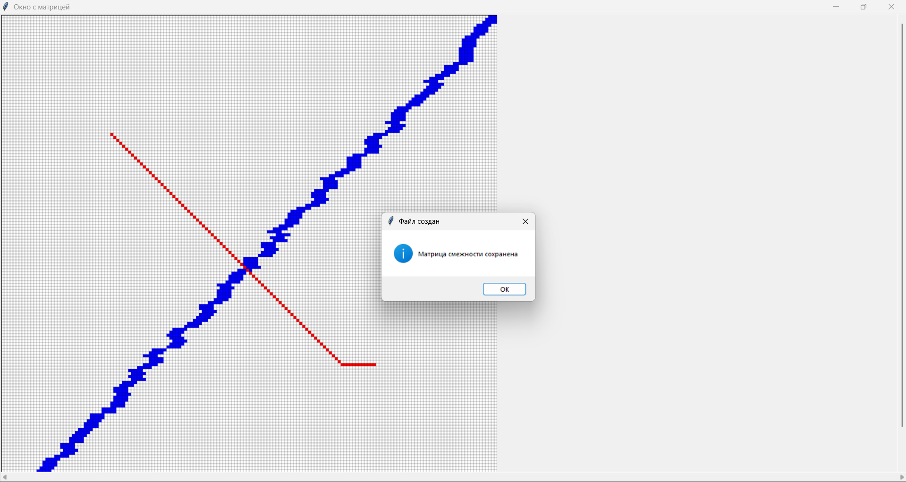

## Инструкция по применению  

Запуск программы осуществляется в файле `lake_inferface.py` &mdash; это интерфейс программы. После запуска появляется окно, где нужно ввести стоимостный коэффициент и название csv файла. Файл должен быть в одном файле с файлами программы.

Пример ввода


После ввода данных, появится окно с матрицей  


Нужно выюрать 2 точки. После выбора точек окно блокируется.  
Пример


После того как была составлена матрица смежности, окно разблокируется и покажет путь красным цветом



Есть уже готовые csv файлы для программы: `res.csv`, `river_data.csv`.  
Файл `river_data.csv` содержит координаты с рекой для матрицы 168х168. Программа с этим файлом работает за 1 секунду и сразу выводит результат.  
Файл `res.data` содердит координаты с озером для матрицы 800х800. Программа обрабатывает этот файл очень долго из-за большого кол-во данных. Точное время не засекал.

В файле `a_star_pca.py` есть функция под названием `adj_matrix()`  &mdash;  эта функция создает csv файл под названием `djacency_matrix.csv` и записывает полученные данные в него. Запись проводится лишь после того как алгоритм A* дошел до конечной точки.
Пример кода сохранения данных в csv файл в этой функции
```
with open('adjacency_matrix.csv', 'w', newline='') as csvfile:
        writer = csv.writer(csvfile, delimiter=';')
        header = [""] + [f"{y},{x}" for (y, x) in all_coor]
        writer.writerow(header)
        
        for coord in all_coor:
            row = [f"{coord[0]},{coord[1]}"] + [adj[coord].get(other_coord, 0) for other_coord in all_coor]
            writer.writerow(row)
```
В эту матрицу смежности записываются все вершины, которые попадались по пути алгоритму А*.

